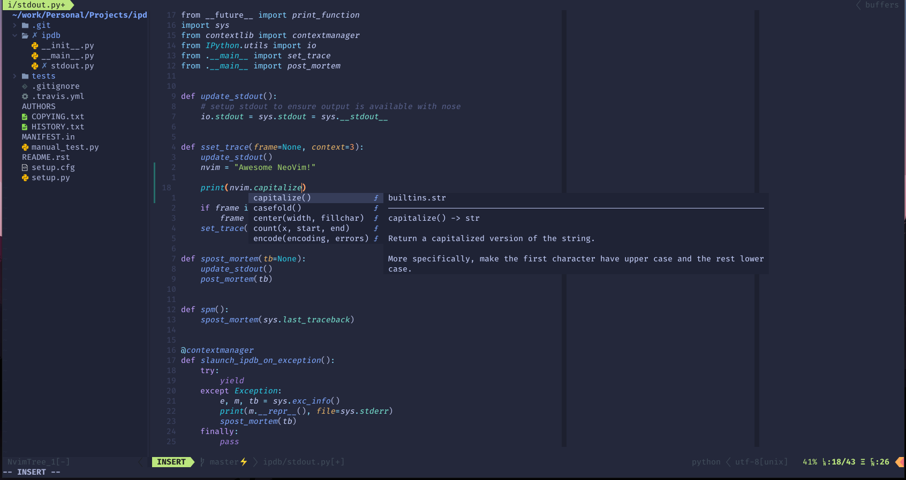
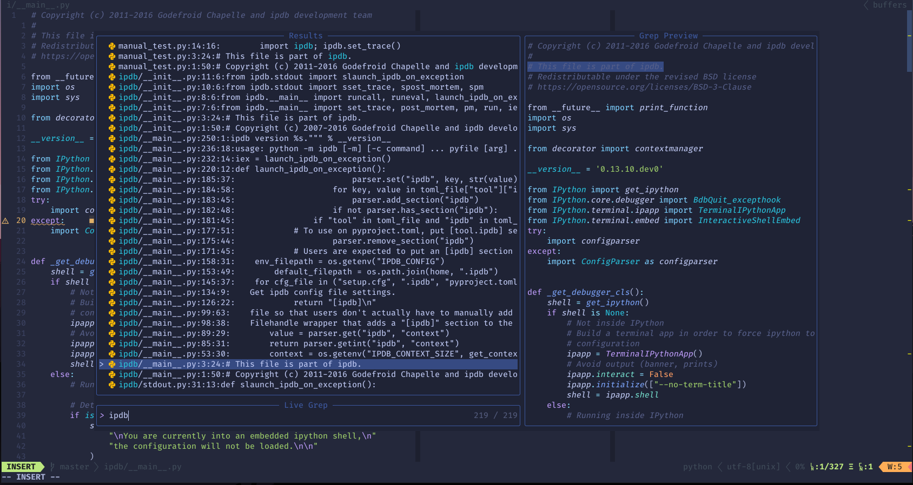
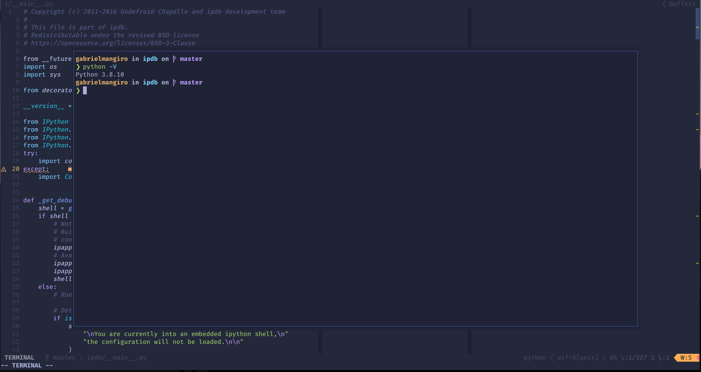
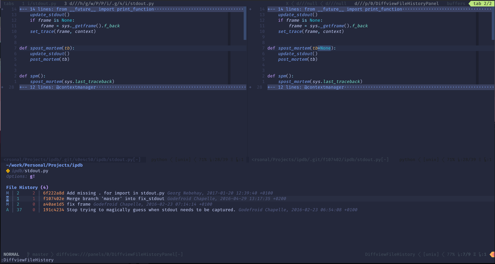

# My Neovim Configuration

# Installation

Once you have installed and configured all [dependencies](#dependencies), follow the steps below:

1. Clone this repo in your `~/.config/nvim` directory.
2. Open Neovim, and install the plugins with `:PlugInstall`.
3. Restart Neovim.
4. Enjoy!

# Inspiration

*Credits:*

This configuration was highly inspired by the [harrisoncramer/nvim](https://github.com/harrisoncramer/nvim) configuration, and contains some code snippets from their repository, but with some modifications =)

# Features

- Syntax highlighting w/ [treesitter](https://github.com/nvim-treesitter/nvim-treesitter)
- Auto completions w/ [nvim-cmp](https://github.com/hrsh7th/nvim-cmp)
- LSPs w/ [lsp-installer](https://github.com/williamboman/nvim-lsp-installer) and [lspconfig](https://github.com/neovim/nvim-lspconfig)
- Git utilities w/ [fugitive](https://github.com/tpope/vim-fugitive), [gitsigns](https://github.com/lewis6991/gitsigns.nvim) and [diffview](https://github.com/sindrets/diffview.nvim)
- Search w/ [telescope](https://github.com/nvim-telescope/telescope.nvim)
- Terminal integration with [FTerm](https://github.com/numToStr/FTerm.nvim)
- [tokyonight](https://github.com/folke/tokyonight.nvim) colorscheme

# Dependencies

- <a href="https://github.com/neovim/neovim">Nvim</a> >=0.6.0
- <a href="https://github.com/junegunn/vim-plug">vim-plug</a>
- Some <a href="https://www.nerdfonts.com/">Nerd Font</a> (optional, to display icons properly).
- <a href="https://github.com/BurntSushi/ripgrep">ripgrep</a>
- <a href="https://github.com/junegunn/fzf">fzf</a>